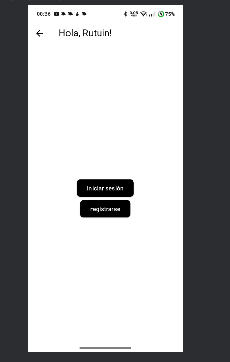
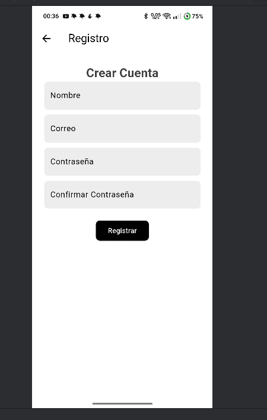
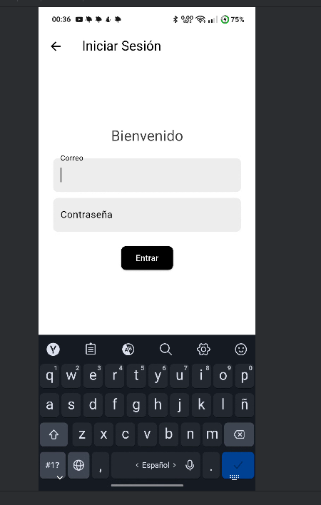
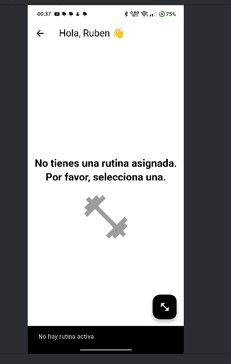
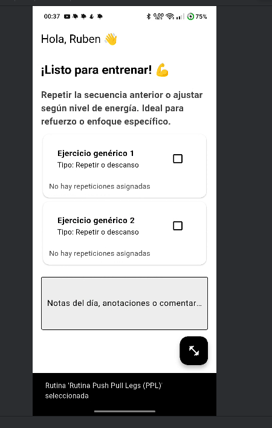
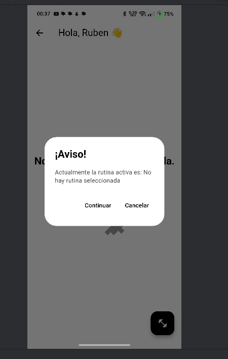
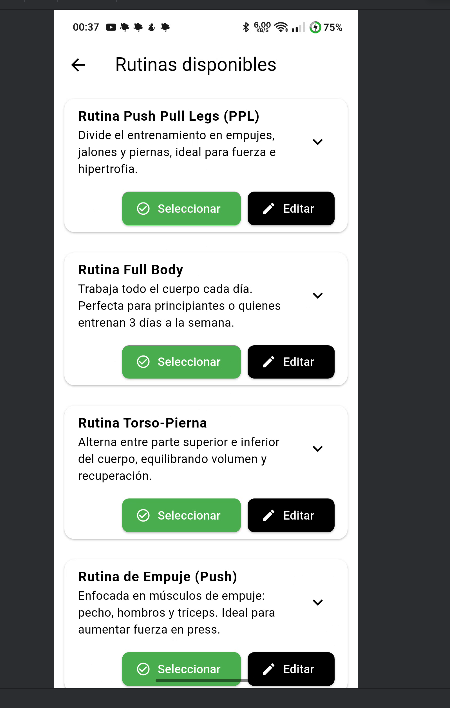
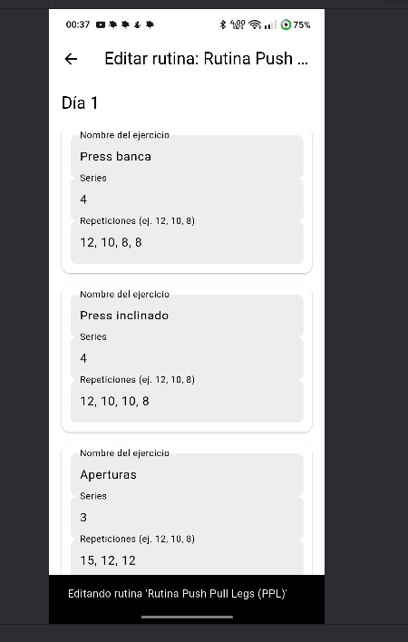

# Rutuin 🏋️‍♂️

Rutuin es una app fullstack modular para crear, gestionar y monitorear rutinas de entrenamiento y hábitos saludables. Consta de un **backend API REST** (Node.js/Express/MongoDB) y un **frontend móvil** (Flutter con Clean Architecture y Provider).
##ES NESESARIO UN LINK CON HTTPS
---

## 📦 Estructura del proyecto y explicación

```
root/
│
├── appServer/                # Backend Node.js/Express
│   ├── models/               # Modelos de datos (Mascota, Rutina, Usuario, etc.)
│   ├── routes/               # Endpoints RESTful de cada entidad
│   ├── server.js             # Punto de arranque del backend y conexión con la base de datos
│   └── package.json
│
├── rutuin/                   # Frontend Flutter
│   ├── lib/
│   │   ├── core/             # Temas y configuración global de la app
│   │   ├── modules/
│   │   │   ├── auth/         # Todo lo relacionado a autenticación (login, registro)
│   │   │   └── pantalla_principal/ # Rutinas, progreso, widgets, lógica principal
│   │   ├── homePage.dart     # Pantalla principal luego de login
│   │   └── main.dart         # Arranque de la app
│   └── ios/                  # Soporte multiplataforma (Android/iOS)
│
├── Ejercicios.json           # Datos de ejemplo de rutinas y ejercicios (pueden usarse para pruebas)
├── Rutinas.json
├── screenshots/              # Capturas de pantalla (usadas abajo)
└── README.md
```

- **models/**: Define la estructura y validación de los datos en MongoDB.
- **routes/**: Implementa los endpoints (REST) que puede consumir la app Flutter.
- **core/**: Centraliza configuración de temas y utilidades globales.
- **modules/auth/**: Lógica, controladores, pantallas y providers para login y registro.
- **modules/pantalla_principal/**: Lógica y presentación de rutinas, progreso y widgets reutilizables.

---

## 📝 Notas de desarrollo y funcionamiento

- **Base de datos:**  
  Se utilizo **MongoDB** y para la gestión visual y edición rápida de los datos se recomienda **MongoDB Compass**.
- **Colecciones mínimas necesarias para funcionamiento:**
  - `usuarios`
  - `rutinas`
  - `usuarioRutina`

---

## 📚 Ejemplo de documentos para cada colección

### **Rutinas**

```json
{
  "_id": { "$oid": "68535653f00e1f2da735bec9" },
  "nombre": "Rutina Push Pull Legs (PPL)",
  "descripcion": "Divide el entrenamiento en empujes, jalones y piernas, ideal para fuerza e hipertrofia.",
  "recomendado": "Ideal si entrenas 5-6 días por semana y quieres progresar en fuerza e hipertrofia.",
  "no_recomendado": "No es ideal si solo puedes entrenar 2-3 veces por semana.",
  "dias": [
    {
      "dia": "Día 1",
      "actividad": "Push (Pecho, Hombros, Tríceps)",
      "detalle": {
        "grupo": "Push",
        "ejercicios": [
          { "nombre": "Press banca", "series": 4, "repeticiones": [12, 10, 8, 8] },
          { "nombre": "Press inclinado", "series": 4, "repeticiones": [12, 10, 10, 8] },
          { "nombre": "Aperturas", "series": 3, "repeticiones": [15, 12, 12] },
          { "nombre": "Press militar", "series": 4, "repeticiones": [12, 10, 8, 8] },
          { "nombre": "Elevaciones laterales", "series": 3, "repeticiones": [15, 12, 12] },
          { "nombre": "Pájaros", "series": 3, "repeticiones": [15, 12, 12] },
          { "nombre": "Fondos", "series": 3, "repeticiones": [12, 10, 8] }
        ]
      }
    }
    // ...días 2, 3, 4, 5
  ],
  "origen": "admin"
}
```

### **Usuarios**

```json
{
  "_id": { "$oid": "6850d09db49389a2177f45a7" },
  "email": "y",
  "contraseña": "<hash_bcrypt>",
  "nombre": "Ruben",
  "medidas": {
    "altura": 0, "peso": 0, "cintura": 0, "cadera": 0, "pecho": 0, "hombros": 0, "brazos": 0,
    "muslo": 0, "pantorrilla": 0, "antebrazo": 0, "cuello": 0, "grasa_corporal": 0, "masa_muscular": 0
  },
  "rol": "usuario",
  "racha_dias_entrenando": 0,
  "sexo": "no especificado",
  "edad": 0,
  "foto_perfil": "",
  "objetivo": "no especificado",
  "nivel_actividad": "no especificado",
  "tipo_entrenamiento": "no especificado",
  "tipo_dieta": "no especificado",
  "dieta_personalizada": false,
  "dieta": [],
  "notificaciones": {
    "notificacion": true,
    "notificaciones_generales": {
      "historial_notificaciones": [
        {
          "tipo": "bienvenida",
          "mensaje": "¡Bienvenido a Rutuin!",
          "fecha": "2025-06-16T20:19:08.035899"
        }
      ]
    },
    "notificaciones_dieta": false,
    "notificaciones_entrenamiento": false,
    "notificaciones_recordatorios": false,
    "notificaciones_actividades": false,
    "notificaciones_noticias": false,
    "notificaciones_promociones": false,
    "notificaciones_eventos": false,
    "notificaciones_recordatorios_dieta": false,
    "notificaciones_recordatorios_entrenamiento": false,
    "notificaciones_recordatorios_actividades": false,
    "notificaciones_recordatorios_noticias": false,
    "notificaciones_recordatorios_promociones": false,
    "notificaciones_recordatorios_eventos": false
  },
  "__v": 0
}
```

### **usuarioRutina**

```json
{
  "_id": { "$oid": "685390e5f00e1f2da735bed6" },
  "usuario_id": "6850d41ab49389a2177f45b1",
  "rutinas_ids": [
    { "rutina": "68535653f00e1f2da735beca", "estado": "activo", "fecha_inicio": "2025-06-15" },
    { "rutina": "684fa1074d50c97e7ded7110", "estado": "inactivo", "fecha_inicio": "2025-06-15" },
    { "rutina": "684fa1074d50c97e7ded7111", "estado": "inactivo", "fecha_inicio": "2025-06-15" }
  ],
  "fecha_inicio": "2025-06-15",
  "progreso": {
    "dias_completados": 2,
    "ultimo_dia_completado": "Día 2"
  },
  "notas_personales": [
    "Voy muy bien, pero el día 2 fue difícil.",
    "Esta semana mejoré en peso muerto."
  ],
  "modificaciones": [
    { "dia": "Día 1", "ejercicios_extra": ["Flexiones diamante"] },
    { "dia": "Día 3", "ejercicios_extra": ["Sentadillas búlgaras"] }
  ],
  "dia1": "2025-06-15"
}
```

---

## 🖼️ Screenshots del flujo completo

<p align="center">
  
  
  
  
  
  
  
  
</p>

---

## ⚙️ Instalación y uso rápido

### 1. Clona el repositorio

```bash
https://github.com/RubenE107/rutuin.git
cd rutuin
```

### 2. Backend (Node.js/Express)

```bash
cd appServer
npm install
npm run dev
```

- Usa [DevTunnels (VS Code)](https://learn.microsoft.com/en-us/windows/dev-tunnels/),
- - Configura la URL generada en tu frontend.

### 3. Frontend (Flutter)

```bash
cd rutuin
flutter pub get
flutter run
```

- Cambia la URL de la API en el código Flutter para apuntar a la dirección https generada.

---
